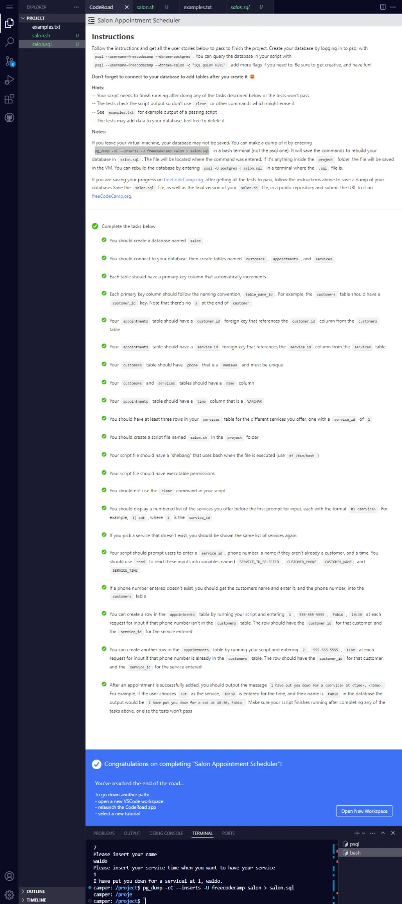

# Build a Salon Appointment Scheduler

[Proyecto requisito obligatorio número 3](https://www.freecodecamp.org/learn/relational-database/build-a-salon-appointment-scheduler-project/build-a-salon-appointment-scheduler) necesario para obtener la [Relational Database Certification](https://www.freecodecamp.org/learn/relational-database/) de freecodecamp.

En resumen, el proyecto consiste en utilizar comandos avanzados de **Bash** para insertar registros en una base de datos PostgreSQL, específicamente, insertar registros en las tablas **customers**, **appointments** y **services**. Además, para aprobar se requiere crear un repositorio el cual incluya los archivos **salon.sql** (el cual es el dump de la base de datos) y el archivo **salon.sh** (el cual contiene el script bash).

## Tabla de Contenidos

- [Build a Salon Appointment Scheduler](#build-a-salon-appointment-scheduler)
  - [Tabla de Contenidos](#tabla-de-contenidos)
  - [Instrucciones and All User Stories passed](#instrucciones-and-all-user-stories-passed)
  - [Proyecto aprobado](#proyecto-aprobado)
  - [Script Bash](#script-bash)

## Instrucciones and All User Stories passed



## Proyecto aprobado


## Script Bash

```bash
#!/bin/bash

PSQL="psql --username=freecodecamp --dbname=salon --tuples-only -c"

echo -e "Welcome to Waldo's Salon\n"

SERVICES=$($PSQL "SELECT * FROM services")
SHOW_SERVICES() {
    echo "$SERVICES" | while read SERVICE_ID BAR SERVICE_NAME; do
        echo -e "$SERVICE_ID) $SERVICE_NAME"
    done
}

CHOOSE_SERVICE() {
    if [[ $1 ]]; then
        echo -e "$1"
    fi
    SHOW_SERVICES

    echo "Please, select a service"
    read SERVICE_ID_SELECTED
    while [[ ! $SERVICE_ID_SELECTED =~ ^[0-9]+$ ]]; do
        echo "Service must be a number. Please insert a valid service"
        SHOW_SERVICES
        read SERVICE_ID_SELECTED
    done

    SERVICE_NAME=$($PSQL "SELECT name FROM services WHERE service_id=$SERVICE_ID_SELECTED" | sed 's/ //')

    while [[ -z $SERVICE_NAME ]]; do
        echo "Service doesn't exist. Please insert a valid service"
        SHOW_SERVICES
        read SERVICE_ID_SELECTED
        while [[ ! $SERVICE_ID_SELECTED =~ ^[0-9]+$ ]]; do
            echo "Service must be a number. Please insert a valid service"
            read SERVICE_ID_SELECTED
        done
        SERVICE_NAME=$($PSQL "SELECT name FROM services WHERE service_id=$SERVICE_ID_SELECTED" | sed 's/ //')
    done
    echo -e "Please, insert your phone number"
    read CUSTOMER_PHONE
    while [[ -z $CUSTOMER_PHONE ]]; do
        echo "Phone cant be empty. Please insert a valid phone"
        read CUSTOMER_PHONE
    done
    CUSTOMER_ID=$($PSQL "SELECT customer_id FROM customers WHERE phone='$CUSTOMER_PHONE'")
    if [[ -z $CUSTOMER_ID ]]; then
        echo "Please insert your name"
        read CUSTOMER_NAME
        while [[ -z $CUSTOMER_NAME ]]; do
            echo "Customer name cant be empty. Please insert a valid name"
            read CUSTOMER_NAME
        done
        INSERT_CUSTOMER=$($PSQL "INSERT INTO customers(phone, name) VALUES('$CUSTOMER_PHONE', '$CUSTOMER_NAME')")
        CUSTOMER_ID=$($PSQL "SELECT customer_id FROM customers WHERE phone='$CUSTOMER_PHONE'")
    else
        CUSTOMER_NAME=$($PSQL "SELECT name FROM customers WHERE customer_id=$CUSTOMER_ID" | sed 's/ //')
    fi

    echo "Please insert your service time when you want to have your service"
    read SERVICE_TIME
    while [[ -z $SERVICE_TIME ]]; do
        echo "Time can't be empty. Please insert a valid time"
        read SERVICE_TIME
    done
    INSERT_APPOINMENT=$($PSQL "INSERT INTO appointments(customer_id, service_id, time) VALUES($CUSTOMER_ID, $SERVICE_ID_SELECTED, '$SERVICE_TIME')")
    if [[ $INSERT_APPOINMENT == "INSERT 0 1" ]]; then
        echo "I have put you down for a $SERVICE_NAME at $SERVICE_TIME, $CUSTOMER_NAME."
    else
        echo "Something went wrong. Please try again"
    fi

}

CHOOSE_SERVICE "Please, choose your service"
```
